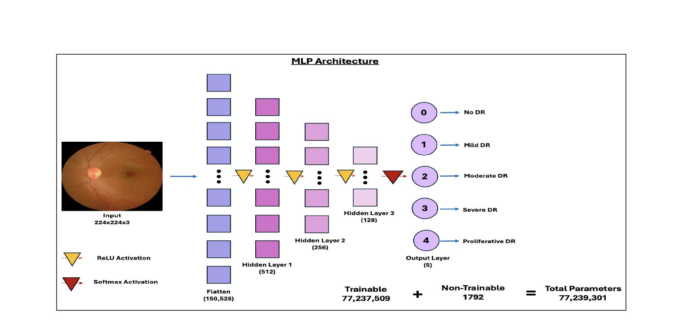
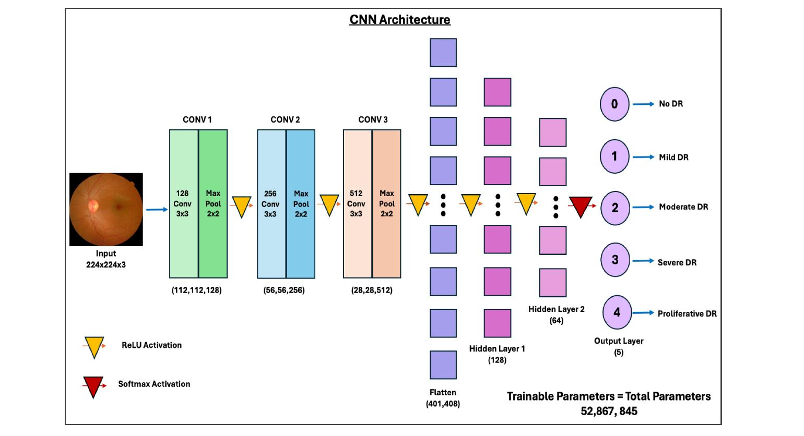
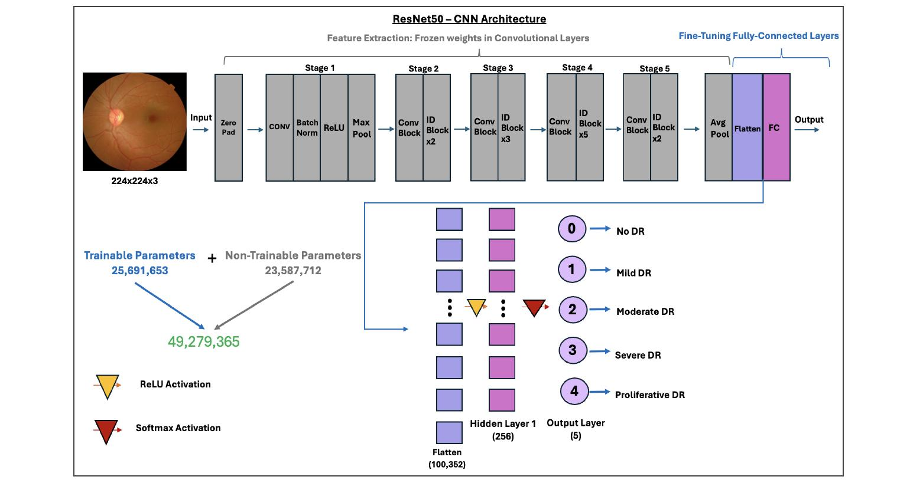

# 👁️ Blindness Detection Using Deep Learning

[](https://www.python.org/)
[](https://www.tensorflow.org/)
[](https://keras.io/)
[](https://www.kaggle.com/competitions/aptos2019-blindness-detection)
[](LICENSE)

---

## 📌 Overview

This project develops a deep learning pipeline to detect **Diabetic Retinopathy (DR)** — a leading cause of blindness in adults — from retinal fundus photographs. Using the APTOS 2019 Kaggle dataset, three progressively advanced neural network architectures were built and compared: a Multi-Layer Perceptron (MLP), a custom Convolutional Neural Network (CNN), and a transfer-learning model based on **ResNet50**. The best model achieves **75.50% test accuracy** and is capable of grading DR severity across five clinical stages.

---

## 🏥 Business Problem

Diabetic Retinopathy is an eye disease caused by prolonged high blood sugar in diabetes patients. It damages the retinal blood vessels and can progress silently — with **no early symptoms** — before causing irreversible vision loss or complete blindness. Early detection is critical, yet the traditional diagnosis process (a dilated eye exam by a specialist) is:

- **Time-consuming** and requires trained ophthalmologists
- **Expensive**, limiting access in low-resource settings
- **Inaccessible** in rural or underserved regions where specialists are scarce

As the global diabetic population grows, there is an urgent need for scalable, automated screening tools that can flag patients at risk before vision loss occurs.

---

## 🎯 Business Objective

Build an automated image classification system that:

1. Ingests retinal fundus photographs
2. Classifies each image into one of five DR severity levels (0–4)
3. Prioritizes high recall on severe stages (Severe DR & Proliferative DR) to minimize dangerous missed diagnoses
4. Is efficient and generalizable enough to support clinical deployment as a pre-screening aid

---

## 📂 Dataset

### Source
- **Competition:** [APTOS 2019 Blindness Detection — Kaggle](https://www.kaggle.com/competitions/aptos2019-blindness-detection/data?select=train_images)
- **Organizer:** Aravind Eye Hospital (India)
- **Format:** PNG retinal fundus images + CSV files with labels

### Dataset Summary

| Split      | Images |
|------------|--------|
| Training   | 2,662  |
| Validation | 200    |
| Test       | 800    |
| **Total**  | **3,662** |

> *Note: Since the Kaggle competition did not release test labels, the original 3,662 labeled training images were manually split into train/validation/test subsets.*

**DR Severity Labels:**

| Label | Class              | Training Count |
|-------|--------------------|---------------|
| 0     | No DR (Healthy)    | 1,318         |
| 1     | Mild DR            | 279           |
| 2     | Moderate DR        | 721           |
| 3     | Severe DR          | 144           |
| 4     | Proliferative DR   | 200           |

### Dataset Challenges

- **Inconsistent image sizes:** Images ranged from 640×480 to 4288×2848 pixels
- **Class imbalance:** Healthy (No DR) images far outnumbered severe disease cases
- **No test labels from Kaggle:** Required creating a custom train/val/test split from labeled data

---

## 🛠️ Tech Stack

| Category          | Tools / Libraries                                      |
|-------------------|--------------------------------------------------------|
| Language          | Python 3.8+                                            |
| Deep Learning     | TensorFlow 2.x, Keras                                 |
| Data Manipulation | Pandas, NumPy                                          |
| Image Processing  | Pillow (PIL), OpenCV                                   |
| Visualization     | Matplotlib, Seaborn                                    |
| ML Utilities      | Scikit-learn (`compute_class_weight`, `confusion_matrix`) |
| Pre-trained Model | ResNet50 (ImageNet weights via `keras.applications`)   |
| Environment       | Jupyter Notebook                                       |

---

## 🔄 Project Workflow

```
Raw Retinal Images (Kaggle APTOS 2019)
        │
        ▼
┌─────────────────────────────────────┐
│     Exploratory Data Analysis       │
│  - Image size distribution          │
│  - Class distribution analysis      │
│  - Sample image visualization       │
└─────────────────┬───────────────────┘
                  │
                  ▼
┌─────────────────────────────────────┐
│     Data Preprocessing              │
│  - Resize all images to 224×224     │
│  - Normalize pixel values (0–1)     │
│  - Data augmentation (train set)    │
│  - Apply class weights for balance  │
└─────────────────┬───────────────────┘
                  │
                  ▼
┌─────────────────────────────────────┐
│     Model Training & Evaluation     │
│                                     │
│  [1] MLP Model                      │
│  [2] Custom CNN Model               │
│  [3] ResNet50 Transfer Learning     │
│                                     │
│  Each model uses:                   │
│  - Adam optimizer                   │
│  - Categorical cross-entropy loss   │
│  - Early stopping (patience=5)      │
│  - Balanced class weights           │
└─────────────────┬───────────────────┘
                  │
                  ▼
┌─────────────────────────────────────┐
│     Model Comparison & Selection    │
│  - Accuracy (Train/Val/Test)        │
│  - Loss metrics                     │
│  - Confusion matrix analysis        │
│  - Critical recall (Severe/Prolif.) │
└─────────────────────────────────────┘
```

---

## 🔍 Exploratory Data Analysis

Performed in `Project_7_Blindness_Detection_EDA.ipynb`:

- **Image file formats:** All images confirmed as `.png`
- **Image size distribution:** Found significant variation (640×480 up to 4288×2848) — necessitating uniform resizing to 224×224 for model compatibility
- **Class distribution:** Severe class imbalance identified — No DR (1,318 images) vs. Severe DR (144 images), a ~9:1 ratio
- **Visual inspection:** Sample images across all five classes revealed subtle visual differences between DR stages, highlighting the difficulty of the classification task

**Key EDA findings:**
- No missing image files across any split
- All images are color (RGB) retinal fundus photographs
- Class imbalance requires mitigation via class weighting and/or augmentation

---

## 🤖 Machine Learning Models

### Preprocessing (Applied to All Models)

All images were resized to **224×224 pixels** and processed through `ImageDataGenerator`:

**Training set augmentations:**
- Rotation (up to 20°–40°) — randomly rotates images to simulate different camera angles
- Width & height shifts (±5%) — slightly translates images horizontally/vertically to reduce positional bias
- Shear transformation (±5%) — applies a tilt/slant effect to increase geometric variety
- Zoom (±20%) — randomly zooms in or out to mimic varying image scales
- Horizontal flipping — mirrors images left-to-right to double effective training data

**Validation & test sets:** Rescaling only (no augmentation)

**Normalization:** Pixel values scaled to [0, 1] for MLP/CNN; `preprocess_input` from ResNet50 used for transfer learning model.

---

### [1] Multi-Layer Perceptron (MLP)

**Notebook:** `Project_7_Blindness_Detection_MLP_Model.ipynb`

**Architecture:**



**Configuration:**
- Optimizer: Adam (lr=0.001)
- Loss: Categorical Cross-Entropy
- Regularization: Batch Normalization + 20% Dropout per hidden layer
- Class imbalance: Balanced class weights
- Early Stopping: patience=5, monitor=val_loss

---

### [2] Custom Convolutional Neural Network (CNN)

**Notebook:** `Project_7_Blindness_Detection_CNN_Part1.ipynb`

**Architecture:**



**Configuration:**
- Optimizer: Adam (lr=0.001)
- Loss: Categorical Cross-Entropy
- Activation: ReLU (hidden), Softmax (output)
- Class imbalance: Balanced class weights
- Early Stopping: patience=5, monitor=val_loss

---

### [3] ResNet50 with Transfer Learning

**Notebook:** `Project_7_Blindness_Detection_CNN_Part2.ipynb`

**Architecture:**



**Configuration:**
- Optimizer: Adam (lr=0.0001) — lower LR for fine-tuning stability
- Loss: Categorical Cross-Entropy
- Preprocessing: `resnet50.preprocess_input` (ImageNet normalization)
- Class imbalance: Balanced class weights
- Callbacks: EarlyStopping (patience=5) + ReduceLROnPlateau (factor=0.2, patience=3, min_lr=1e-6)

---

## 📊 Model Performance Comparison

| Metric                     | MLP            | Custom CNN     | ResNet50 CNN   |
|----------------------------|:--------------:|:--------------:|:--------------:|
| Trainable Parameters       | 77,237,509     | 52,867,845     | 25,691,653     |
| Best Epoch                 | 5              | 12             | 11             |
| Train Accuracy             | 47.45%         | 63.64%         | **74.68%**     |
| Validation Accuracy        | 62.50%         | 71.00%         | **83.50%**     |
| Test Accuracy              | 55.75%         | 66.37%         | **75.50%**     |
| Train Loss                 | 1.464          | 1.219          | **0.785**      |
| Validation Loss            | 0.975          | 0.777          | **0.508**      |
| Test Loss                  | 1.047          | 0.901          | **0.625**      |
| Recall — Severe DR         | 30.56%         | 19.44%         | **55.56%**     |
| Recall — Proliferative DR  | 17.95%         | 35.90%         | **39.74%**     |

> *Best values bolded. Accuracy and loss values reported at best epoch (lowest val_loss).*

### Confusion Matrix Summary (Test Set — ResNet50)

|              | Pred: 0 | Pred: 1 | Pred: 2 | Pred: 3 | Pred: 4 |
|--------------|:-------:|:-------:|:-------:|:-------:|:-------:|
| **True: 0**  | 365     | 8       | 3       | 0       | 0       |
| **True: 1**  | 11      | 49      | 14      | 1       | 3       |
| **True: 2**  | 11      | 40      | 139     | 25      | 17      |
| **True: 3**  | 0       | 2       | 11      | 20      | 3       |
| **True: 4**  | 0       | 10      | 23      | 14      | 31      |

---

## 🏆 Best Model Analysis

**ResNet50-Based CNN (Transfer Learning)** is the top-performing model across all evaluation dimensions:

### Why ResNet50 Wins

**1. Feature Extraction**
CNNs inherently learn spatial, hierarchical features from images — critical for detecting subtle retinal changes like microaneurysms, exudates, and neovascularization. ResNet50's 50-layer architecture, pre-trained on 1.2M ImageNet images, provides extremely rich feature representations out-of-the-box.

**2. Skip Connections Solve Degradation**
ResNet50's residual (skip) connections allow gradients to flow through very deep layers without vanishing, enabling the model to learn complex representations that shallower architectures cannot.

**3. Parameter Efficiency**
With only 25.7M trainable parameters (vs. 77M for MLP), ResNet50 achieves the best accuracy while being less prone to overfitting and more deployment-friendly.

**4. Lowest Loss Across All Splits**
Train loss 0.785 | Val loss 0.508 | Test loss 0.625 — superior calibration means more confident and reliable predictions.

**5. Critical Recall on High-Risk Classes**
ResNet50 is the safest model clinically:
- **Severe DR recall: 55.56%** (vs. 30.56% MLP, 19.44% CNN)
- **Proliferative DR recall: 39.74%** (vs. 17.95% MLP, 35.90% CNN)
- **Zero Severe DR or Proliferative DR cases misclassified as healthy**

---

## ✅ Recommended Model

> **ResNet50 CNN with Transfer Learning (Feature Extraction Mode)**

This model is recommended for clinical pre-screening due to its:
- Highest test accuracy (75.50%)
- Strongest generalization (val accuracy 83.50%)
- Best critical recall on Severe and Proliferative DR
- Elimination of dangerous healthy misclassifications for high-risk stages
- Computational efficiency suitable for deployment

---

## 💡 Key Findings

- **MLPs are fundamentally unsuitable for retinal image classification.** Flattening 224×224×3 images destroys spatial structure; the MLP underfits despite 77M parameters.

- **Custom CNNs offer a significant leap.** The 3-block CNN improved test accuracy by ~10 percentage points over the MLP with fewer parameters, confirming the value of spatial feature learning.

- **Transfer learning is the clear winner.** ResNet50 dramatically improved performance with less data and fewer trainable parameters — particularly for underrepresented, clinically critical classes (Severe DR, Proliferative DR).

- **Class imbalance is a persistent challenge.** Even with balanced class weights, minority classes (Severe DR: only 144 training images) remain difficult to classify reliably.

- **Training accuracy consistently lagged validation accuracy** in MLP and CNN models due to data augmentation presenting varied inputs each epoch — this is expected and indicates good regularization, not overfitting.

- **ReduceLROnPlateau was critical for ResNet50.** Dynamically reducing the learning rate during training stabilized convergence and improved the model's best epoch performance.

---

## 💼 Business Impact

| Impact Area              | Detail                                                                                                                 |
|--------------------------|------------------------------------------------------------------------------------------------------------------------|
| **Early Detection**      | Automated screening enables earlier intervention before irreversible vision loss, improving patient outcomes            |
| **Scalability**          | A deployed model can screen thousands of patients per day, far exceeding what manual review allows                     |
| **Cost Reduction**       | Pre-screening reduces unnecessary specialist appointments; only flagged cases require expert review                    |
| **Healthcare Access**    | Enables DR screening in rural and low-resource clinics without on-site ophthalmologists                                |
| **Clinical Safety**      | ResNet50's zero misclassification of Severe/Proliferative DR as "healthy" directly reduces the risk of missed diagnoses |
| **Workflow Integration** | The model can be integrated into existing retinal photography workflows as an automated first-pass triage tool          |

---

## 📁 Repository Structure

```
Blindness-Detection-Deep-Learning/
│
├── Data/
│   ├── train_data/                    # Training retinal images (.png)
│   ├── val_data/                      # Validation retinal images (.png)
│   ├── test_data/                     # Test retinal images (.png)
│   ├── train_data.csv                 # Training labels (id_code, diagnosis)
│   ├── val_data.csv                   # Validation labels
│   └── test_data.csv                  # Test labels
│
├── Notebook/
│   ├── Project_7_Blindness_Detection_EDA.ipynb            # Exploratory Data Analysis
│   ├── Project_7_Blindness_Detection_MLP_Model.ipynb      # MLP Model
│   ├── Project_7_Blindness_Detection_CNN_Part1.ipynb      # Custom CNN Model
│   └── Project_7_Blindness_Detection_CNN_Part2.ipynb      # ResNet50 Transfer Learning
│
├── Report/
│   ├── Project_Report__Bindness_Detection.pdf                 # Full project report
└── README.md
```

---

## 🚀 Future Improvements

1. **Fine-tune ResNet50 convolutional layers** — Unfreeze later ResNet50 blocks and fine-tune with a very low learning rate to further adapt ImageNet features to retinal imaging.

2. **Explore additional pre-trained architectures** — EfficientNet, DenseNet, InceptionV3, or domain-specific models like RETFound (a retinal foundation model) may outperform ResNet50.

3. **Apply advanced class imbalance strategies** — SMOTE-based image oversampling, ADASYN, or weighted sampling to better handle the Severe DR class (only 144 training images).

---

## 📚 References

- [APTOS 2019 Blindness Detection — Kaggle Competition](https://www.kaggle.com/competitions/aptos2019-blindness-detection)
- [NIH — Diabetic Retinopathy](https://www.nei.nih.gov/learn-about-eye-health/eye-conditions-and-diseases/diabetic-retinopathy)
- He, K., et al. (2016). *Deep Residual Learning for Image Recognition.* CVPR.
- Gulshan, V., et al. (2016). *Development and Validation of a Deep Learning Algorithm for Detection of Diabetic Retinopathy in Retinal Fundus Photographs.* JAMA.

---

## 👩‍💻 Author

**Reemika Subrata Das**

[](https://linkedin.com/in/reemikadas)
[](https://github.com/reemikadas)
[](mailto:das.reemika@gmail.com)

---

